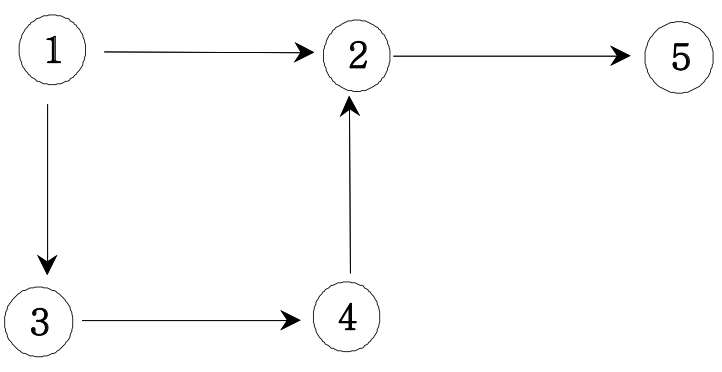
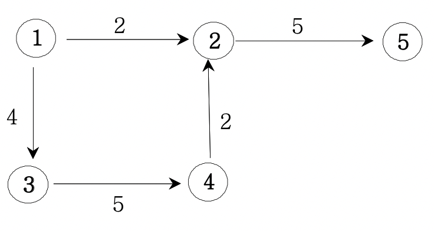

# 그래프와 인접행렬

> ## 문제

그래프는 `G(V, E)`로 표현한다.<br/>
(V: vertex(노드, 정점), E: Egde(노드와 노드사이 선))

```
1. 무방향 그래프
```

만약 입력에 들어오면, `1 2`로 표현하여 1번 노드와 2번 노드가 연결됨을 알려준다.<br/>
그래프 표현은 인접배열로 2차원배열에 표현한다.
```
a b
1 2 로 두면,

graph[a][b]=1;
graph[b][a]=1; 로 표현한다.
```

```
2. 방향 그래프
```

행번호에서 열번호로 이동한다. 
```
a b
1 2 로 두면,

graph[a][b]=1; 로 표현한다.
```

```
3. 가중치 방향 그래프
```

```
a b c
1 2 2 로 두면,

graph[a][b]=c; 로 표현한다.
```
***