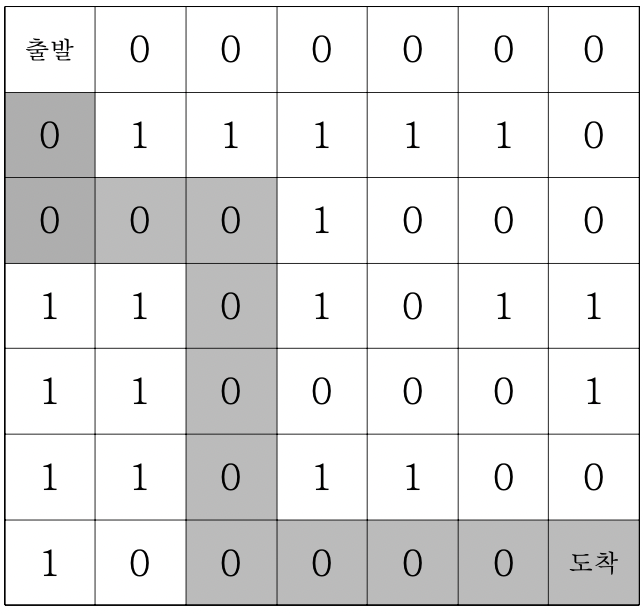

# 미로탐색

> ## 문제

```
7*7 격자판 미로를 탈출하는 경로의 가지수를 출력하는 프로그램을 작성하세요. 출발점은 격 자의 (1, 1) 좌표이고, 탈출 도착점은 (7, 7)좌표이다. 격자판의 1은 벽이고, 0은 통로이다. 격 자판의 움직임은 상하좌우로만 움직인다. 미로가 다음과 같다면 출발점에서 도착점까지 갈 수 있는 방법의 수는 8가지이다.
```

***

> ## 풀이

출발점은 `(0, 0)`이고, 도착점은 `(6, 6)`이다.

`(0, 0)`에서 갈 수 있는 방향은 `(-1, 0)`, `(0, 1)`, `(1, 0)`, `(0, -1)`이다.
***

#### 전체 코드
```html
<html>

<head>
  <meta charset="UTF-8">
  <title>미로탐색</title>
</head>

<body>
  <script>
    function solution(board) {
      let answer = 0;
      let dx = [-1, 0, 1, 0];
      let dy = [0, 1, 0, -1];
      function DFS(x, y) {
        if (x === 6 && y === 6) answer++;
        else {
          for (let k = 0; k < 4; k++) {
            let nx = x + dx[k];
            let ny = y + dy[k];
            if (nx >= 0 && nx <= 6 && ny >= 0 && ny <= 6 && board[nx][ny] === 0) {
              board[nx][ny] = 1;    // 왔던 길 표시
              DFS(nx, ny);
              board[nx][ny] = 0;
            }
          }
        }
      }
      board[0][0] = 1;
      DFS(0, 0);
      return answer;
    }

    let arr = [[0, 0, 0, 0, 0, 0, 0],
    [0, 1, 1, 1, 1, 1, 0],
    [0, 0, 0, 1, 0, 0, 0],
    [1, 1, 0, 1, 0, 1, 1],
    [1, 1, 0, 0, 0, 0, 1],
    [1, 1, 0, 1, 1, 0, 0],
    [1, 0, 0, 0, 0, 0, 0]];

    console.log(solution(arr));
  </script>
</body>

</html>
```