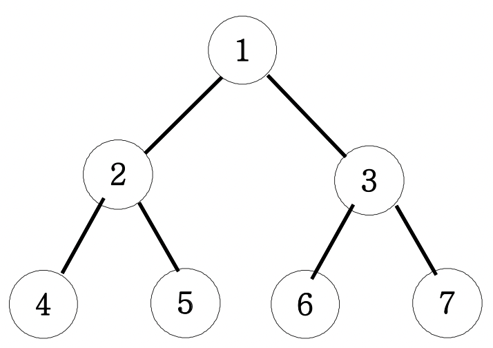

# 이진트리 넓이 우선 탐색

> ## 문제

```
아래 그림과 같은 이진트리를 넓이우선탐색해 보세요.
```

***

> ## 풀이

레벨별로 모든 것을 탐색한다. (queue 사용)

1을 queue에 push하고, 탐색하면 pop한다.<br/>
그리고 queue에 1과 연결된 노드(2, 3)를 push한다.

그리고 2를 탐색하면 queue에서 2를 shift한다.<br/>
2와 연결된 노드(4, 5)를 queue에 push한다. (현재 queue에는 3 4 5)<br/>
이제 3이 shift된다.
***

#### 전체 코드
```html
<html>

<head>
  <meta charset="UTF-8">
  <title>이진트리 넓이우선탐색</title>
</head>

<body>
  <script>
    function solution() {
      let answer = "";
      let queue = [];
      queue.push(1);
      while (queue.length) {
        let v = queue.shift();
        answer += v + " ";
        for (let nv of [v * 2, v * 2 + 1]) {
          if (nv > 7) continue;
          queue.push(nv);
        }
      }
      return answer;
    }

    console.log(solution());
  </script>
</body>

</html>
```