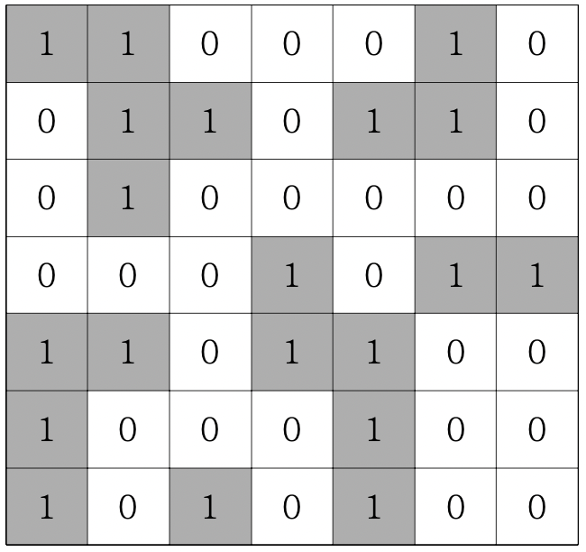

# 섬나라 아일랜드(DFS)

> ## 문제

```
N*N의 섬나라 아일랜드의 지도가 격자판의 정보로 주어집니다. 각 섬은 1로 표시되어 상하좌 우와 대각선으로 연결되어 있으며, 0은 바다입니다. 섬나라 아일랜드에 몇 개의 섬이 있는지 구하는 프로그램을 작성하세요.
```

***

> ## 풀이

이중 for문이 돌면서 8방향으로 다 탐색해야한다. 지나온 길은 0으로 변경한다.
***

#### 전체 코드
```html
<html>

<head>
  <meta charset="UTF-8">
  <title>섬나라 아일랜드(DFS)</title>
</head>

<body>
  <script>
    function solution(board) {
      let answer = 0;
      let n = board.length;
      let dx = [-1, -1, 0, 1, 1, 1, 0, -1];
      let dy = [0, 1, 1, 1, 0, -1, -1, -1];
      function DFS(x, y) {
        // 넘겨받은 지점 0으로 바꿈
        board[x][y] = 0;
        for (let k = 0; k < 8; k++) {
          let nx = x + dx[k];
          let ny = y + dy[k];
          if (nx >= 0 && nx < n && ny >= 0 && ny < n && board[nx][ny] === 1) {
            DFS(nx, ny);
          }
        }
      }
      for (let i = 0; i < n; i++) {
        for (let j = 0; j < n; j++) {
          if (board[i][j] === 1) {
            answer++;
            DFS(i, j);
          }
        }
      }
      return answer;
    }

    let arr = [[1, 1, 0, 0, 0, 1, 0],
    [0, 1, 1, 0, 1, 1, 0],
    [0, 1, 0, 0, 0, 0, 0],
    [0, 0, 0, 1, 0, 1, 1],
    [1, 1, 0, 1, 1, 0, 0],
    [1, 0, 0, 0, 1, 0, 0],
    [1, 0, 1, 0, 1, 0, 0]];

    console.log(solution(arr));
  </script>
</body>

</html>
```