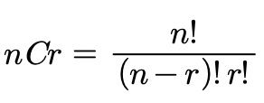
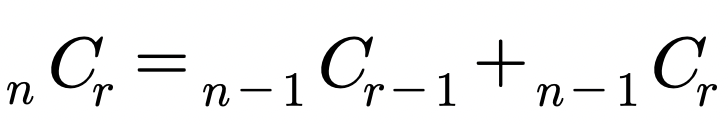

# 조합의 경우 수 (메모이제이션)

> ## 문제

 로 계산합니다. 하지만 여러분은 이 공식을 쓰지않고 다음 공식을 사용하여 재귀를 이용해 조합수를 구해주는 프로그램을 작성하세요.

***

> ## 풀이

n을 포함해서 n을 제외한 나머지 수에서 r-1개의 수를 뽑는 경우와 n을 제외하고 나머지에서 r개의 수를 뽑는 경우
```
5C3
|         \
4C2     +  4C3
|       \
3C1    + 3C2
|     \
2C0 + 2C1
```
***

#### 전체 코드
```html
<html>

<head>
  <meta charset="UTF-8">
  <title>조합수</title>
</head>

<body>
  <script>
    function solution(n, r) {
      let answer;
      function DFS(n, r) {
        if (n === r || r === 0) return 1;
        else return DFS(n - 1, r - 1) + DFS(n - 1, r);
      }
      answer = DFS(n, r);
      return answer;
    }

    console.log(solution(5, 3));
  </script>
</body>

</html>
```
```html
<!-- 메모이제이션 사용 -->
<html>

<head>
  <meta charset="UTF-8">
  <title>조합수</title>
</head>

<body>
  <script>
    function solution(n, r) {
      let answer;
      // 3행 5열의 2차원 배열
      // let dy = Array.from(Array(3), () => Array(5).fill(0));
      let dy = Array.from(Array(35), () => Array(35).fill(0));
      function DFS(n, r) {
        if (dy[n][r] > 0) return dy[n][r];
        if (n === r || r === 0) return 1;
        // 2차워 배열에 값을 저장한 후 2차원 배열을 return 한다.
        else return dy[n][r] = DFS(n - 1, r - 1) + DFS(n - 1, r);
      }
      answer = DFS(n, r);
      return answer;
    }

    console.log(solution(5, 3));
  </script>
</body>

</html>
```