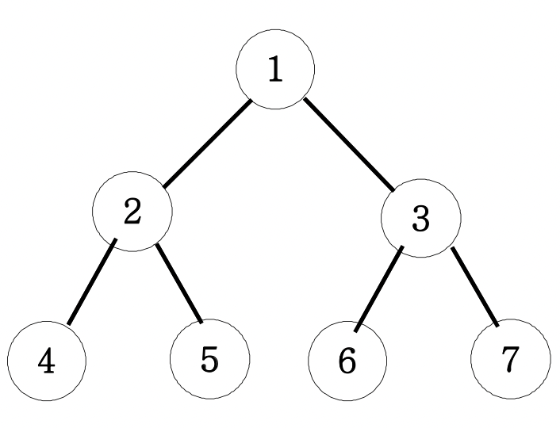

# 이진트리순회 (DFS:깊이우선탐색)

> ## 문제

```
아래 그림과 같은 이진트리를 전위순회와 후위순회를 연습해보세요.
```

***

> ## 풀이

제일 위 부모노드를 root node라고 한다.

#### 전위순회
부모 -> 왼쪽 -> 오른쪽 순으로 출력한다.
#### 중위순회
왼쪽 -> 부모 => 오른쪽 순으로 출력한다.
#### 후위순회
왼쪽 -> 오른쪽 -> 부모 순으로 출력한다.
***

#### 전체 코드
```html
<html>

<head>
  <meta charset="UTF-8">
  <title>이진트리 순회</title>
</head>

<body>
  <script>
    function solution(n) {
      let answer;
      function DFS(n) {
        if (n > 7) return;
        else {
          /* 전위순회 */
          console.log(n);
          DFS(n * 2);
          /* 중위순회 */
          // console.log(n);
          DFS(n * 2 + 1);
          /* 후위순회 */
          // console.log(n);
        }
      }
      DFS(n);
      return answer;
    }

    console.log(solution(1));
  </script>
</body>

</html>
```